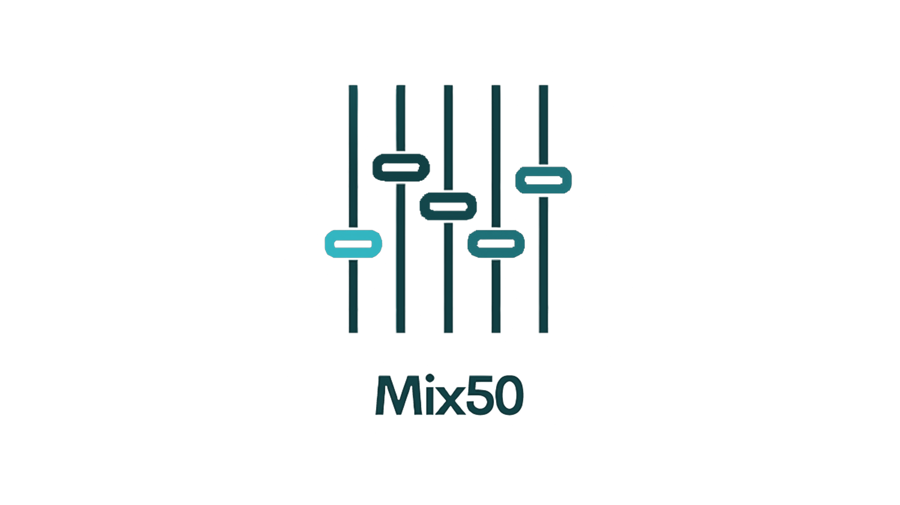
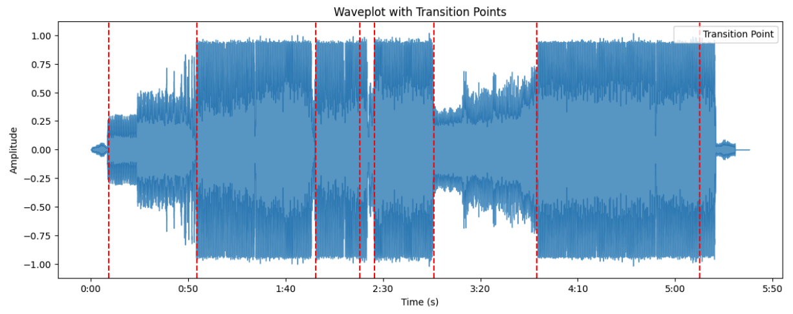

[](https://github.com/Naereen/StrapDown.js/blob/master/LICENSE)
[](http://makeapullrequest.com)

<picture>
  <source srcset="./Images/mix50-inverted.png" media="(prefers-color-scheme: dark)" />
  
</picture>

# Mix50
Mix50 is an audio effect and DSP library that runs effects on music files. 
You can retrieve audio features like key, bpm, beatgrid, transition cues. You can also apply audio effects like filters, fades, and time warping.


## Installation
> Tested on Python 3.11 and later
```bash

$ pip install Mix50
```

## Audio Effects 
Analyze a WAV audio file -
```python
import Mix50

#Create mixfifty instance
Mixfifty = Mix50.MixFifty()

#Load Audio(s)
MixFifty.load_audio('your_mp3_file.mp3')

#Use the effects module to fade audio in at 15s for 10s
MixFifty.effects.fade_in(start_time=15,fade_duration=10)

#Use the effects module to utilize filter highpass
MixFifty.effects.highpass_control(start_time=15, end_time=30, cutoff_freq=1000)

#Use the effects module to control speed of audio
MixFifty.effects.speed_control(start_time=15, end_time=30, original_bpm=126, new_bpm=120)
```

## Audio Features 

```python
import Mix50

#Create mixfifty instance
Mixfifty = Mix50.MixFifty()

#Load Audio(s)
MixFifty.load_audio('your_mp3_file.mp3')

#Get BPM of Audio
MixFifty.features.bpm()

#Get Key of Audio
MixFifty.features.key()

#Get a dataframe of a beatgrid to mix audio files and understand transition cues
MixFifty.features.beats()

==> beats    downbeat    loop_cues    transitions
    9.102    9.102       9.102        9.102
    9.590    NaN         NaN          NaN
    10.054   NaN         NaN          NaN
    10.542   NaN         NaN          NaN
    11.006   11.006      NaN          NaN
... ... ... ... ...
    317.486  NaN         NaN          NaN
    317.974  NaN         NaN          NaN
    318.438 318.438      NaN          NaN
    318.903 NaN          NaN          NaN
    319.390 NaN          NaN          NaN

#Visualize transition cues
MixFifty.features.show_transition_points()

```
<p align="center">
  
</p>


## Audio Transitions

Mix50 generates transitions based on the beatgrid derived from the audio.

### Parameters

- **`cue_num1`**: Specifies the transition cue for the start of song #1. Typically, songs have up to 10 transition points, but this parameter allows for experimentation.
  
- **`cue_num2`**: Specifies the transition cue for the start of song #2. As with `cue_num1`, songs generally have up to 10 transition points, but this parameter is designed for experimentation.

- **`filter_type`**: Specifies the filter you want to apply to transition the audios. Choices are 'highpass', 'lowpass', or 'none.'
```python

#Create mixfifty instance
Mixfifty = Mix50.MixFifty()

#Load Two Audio files
MixFifty.load_audio('your_mp3_file1.mp3', 'your_mp3_file2.mp3')

#Create crossfade transition
MixFifty.transitions.crossfade(cue_num1=8,cue_num2=6,fade_duration=10,filter_type='none')
```

## Save & Export Audio

```python

#Save affected audio to a variable 
affected_audio = MixFifty.effects.fade_out(start_time=15,fade_duration=15)

# Play audio in an interactive environment
affected_audio.play()

# Output:
# ==> IPython.lib.display.Audio

# Return raw audio as a numpy array
affected_audio.raw_audio()

# Output:
# ==> array([ 9.06439368e-11,  1.45156775e-10, -1.51146651e-10, ..., 0.00000000e+00,  0.00000000e+00,  0.00000000e+00])

# Save as an audio file
affected_audio.save("path/to/save.mp3")

```